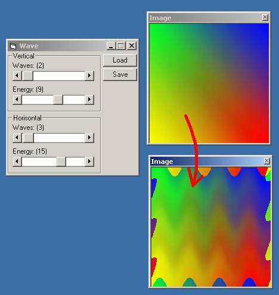



## Image Wave

### Description

Image Effect: Sinus Wave on a selected image.
 
### More Info
 
An Image...

nah

A "Waved" Image

             |
---                |---
**Submitted On**   |2000-11-15 17:16:32
**By**             |[Thomas Raben](https://github.com/Planet-Source-Code/PSCIndex/blob/master/ByAuthor/thomas-raben.md)
**Level**          |Advanced
**User Rating**    |4.0 (8 globes from 2 users)
**Compatibility**  |VB 5\.0, VB 6\.0
**Category**       |[Graphics](https://github.com/Planet-Source-Code/PSCIndex/blob/master/ByCategory/graphics__1-46.md)
**World**          |[Visual Basic](https://github.com/Planet-Source-Code/PSCIndex/blob/master/ByWorld/visual-basic.md)
**Archive File**   |[CODE\_UPLOAD1170811152000\.zip](https://github.com/Planet-Source-Code/thomas-raben-image-wave__1-12813/archive/master.zip)

### API Declarations

some...

